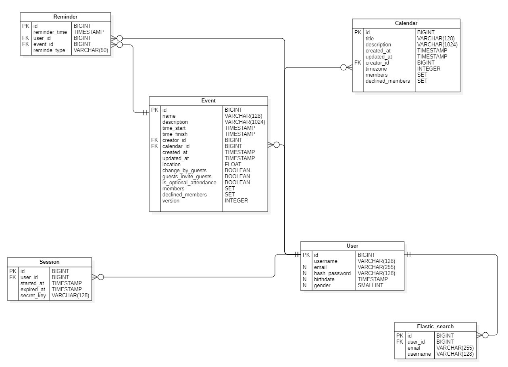

# Google Calendar - описание высоконагруженного сервиса
## Содержание(в будущем)
## 1. Тема и целевая аудитория
[Google Calendar](https://calendar.google.com) - это бесплатный сервис для организации расписания, координации встреч с другими людьми, а также фиксирования и напоминания о важных задачах и событиях.
### MVP функционал
1. Авторизация при помощи аккаунта Google
2. Отображение календаря
3. Добавление новых задач на календарь
4. Изменить информацию о задаче
5. Уведомления о ближайших событиях
6. Добавить гостей к мероприятию(задаче)
7. Просмотр календаря другими пользователями

### Целевая аудитория
* MAU (monthly active users) - ~ 500 млн чел [8]
* Т.к. нет информации по DAU - возьмем средний Sticky Factor(отношение DAU к MAU)[2] = 25% -> DAY ~ 125 млн чел
* Средняя длина сессии - 7:39 [3]
* Количество посещений в день - 3 млрд [12]
* Создается более 1,5 млрд событий в календарях каждый день [7]
* Около 1.1 млрд сайтов используют этот календарь [1]
* 398 тыс. компаний используют Google Calendar [1]
* Для отрослевого рынка - 23,91% [1]
#### Аудитория по странам:

#### Демография посещаемости сайта:

## 2. Расчет нагрузки
### Продуктовые метрики
* MAU (monthly active users) - ~ 500 млн чел [[8]](https://web.archive.org/web/20250125115152/https://www.patronum.io/key-google-workspace-statistics-for-2023)
* Т.к. нет информации по DAU - возьмем средний Sticky Factor(отношение DAU к MAU) = 25% -> DAU ~ 125 млн чел
#### Размер хранилища пользователя
Для рассчета размера хранилища необходимо найти вес одного события(задачи) и вес одного календаря\
Событие:\
Для удобства напишу весь данных в табличке. Возьмем среднюю заполненность события, и при учете кодировки UTF-8(от 1 до 4 байт, возьму 3 байта как среднее) получим:
Параметр | Вес
------- | -------
Название события | 128 символов -> 3*128=384 Байт
Описание события | 1024 символа -> 3*1024=3072 Байт
Дата начала события | 8 Байт
Дата конца события | 8 Байт
Дата создания события | 8 Байт
Дата обновления события | 8 Байт
Место проведения события | 8 Байт
Время уведомления | 8 байт
Email приглашенного гостя | 255 Байт (85 символов) (Возьмем количество гостей = 2) -> 2*255=510 Байт
Создатель события(ссылка) | 8 Байт
Разрешения для гостей | 2 Байт
Календаль события | 8 Байт
Итого | 384 + 3072 + 8 + 8 + 8 + 8 + 8 + 8 + 510 + 8 + 2 + 8 = 4032 Байт

Итак, в день создается около 1,5 млрд. событий [[7]](https://web.archive.org/web/20240811062050/https://marketsplash.com/google-workspace-statistics/). То есть каждый пользователь создает 1.5 млрд/125 млн = 12 событий в день. В среднем работник проводит около 5 встреч в день [[9]](https://reclaim.ai/blog/productivity-report-one-on-one-meetings). Однако это немного больше кол-во событий для обычного пользователя, поэтому возьмем среднее число - 3 события в день.

Сами события хранятся вечно, удаленные события хранятся 30 дней, приложение синхронизирует события последнего года [[5]](https://www.calendar.com/blog/how-do-you-look-up-past-appointments-in-your-calendar/) -> Хранилище событий на 1 пользователя: 365 * 3 * 4032 = 4,21 Мб

Лимит на созданиее событий = 10000, лимит на создание календарей = 25 [[4]](https://classroom.synonym.com/google-calendar-limits-17378.html)

Календарь:
Параметр | Вес
------ | ------
Название календаря | 128 символов -> 3*128=384 Байт
Описание календаря | 1024 символов -> 3*1024=3072 Байт
Дата создания календаря | 8 Байт
Дата обновления календаря | 8 Байт
Создатель календаря(ссылка) | 8 Байт
Часовой пояс календаря | 8 Байт
Итого | 384 + 3072 + 8 + 8 + 8 + 8 = 3488 Байт

Возьмем лимит на создание календарей(25 штук) и посчитаем размер хранилиша для календарей: 25 * 3488 = 85,15 Кб

Итак, средний размер хранилища пользователя равен(возьмем данные пользователя за 1Кб): 4,21 Мб + 85,15 Кб + 1 Кб = 4,29 Мб

Итог по продуктовым метрикам:
Параметр | Значение
------ | ------
Месячная аудитория | 500 млн. человек
Дневная аудитория | 125 млн. человек
Средний размер хранилища пользователя | 4,29 Мб
Добавление событий | 3 запроса/день
Получение напоминаний о событиях | 2 запроса/день

### Технические метрики
#### Размер хранения в разбивке по типам данных
Возьмем общее число пользователей Google Workspace - 3 млрд чел[[7]](https://web.archive.org/web/20240811062050/https://marketsplash.com/google-workspace-statistics/) -> можем посчитать размер хранения данных

Для событий: 4,29 Мб * 3 млрд. = 11,98 Пб

Для календарей: 85,15 Кб * 3 млрд. = 237,9 Тб

#### Сетевой трафик:
Посчитаем сетевой трафик при просмотре каледаря, создании события, приглашении гостя (возьмем по 2 приглашенныйх гостя), ответ гостя на приглашение, получение напоминания:
* Просмотр календаря: 5 запросов в день -> 5 * 3488 Байт = 17,03 Кб
* Создание события: 3 запроса в день -> 3 * 4032 Байт = 11,81 Кб
* Изменить информацию о задаче(событии): 1 запрос в день -> 1 * 4032 Байт = 3,93 Кб
* Приглашение гостя: 4 запроса в день (приглашение = 1Кб) -> 4 * 2 * 1 Кб = 8 Кб
* Ответ гостя: 3 запроса в день -> 3 * 1 Кб = 3 Кб
* Получение напоминания: 2 запроса в день -> 2 * 1 Кб = 2 Кб

Потребление трафика:
Возьмем, что пиковое значение превышает среднее в 2 раза
Тип трафика | Данные | Пиковое в Гбит/c | Суммарный суточной Гб/cутки
------ | ------ | ----- | -----
Просмотр календаря | 125 млн * 17,03 Кб = 16 241,1 Гбит | 0,37 | 84,5
Создание события | 125 млн * 11,81 Кб = 11 262,9 Гбит | 0,26 | 58,66
Изменить информацию о задаче(событии) | 125 млн * 3,93 Кб = 3 747,9 Гбит | 0,08 | 19,52
Приглашение гостя | 125 млн * 8 Кб = 7 629,4 | 0,17 | 39,7
Ответ гостя | 125 млн * 3 Кб = 2 861,1 | 0,06 | 14,9
Получение напоминания | 125 млн * 2 Кб = 1 907,3 | 0,04 | 9,93
Итого | 43 648,7 Гбит | 0,98 | 227,21

#### RPS
Возьмем, что пиковое значение превышает среднее в 2 раза
Тип трафика | RPS(средний) | Пиковый RPS  | 
------ | ------ | -----
Просмотр календаря | 125 млн * 5 / (24 * 60 * 60) = 7 234 | 14 468
Создание события | 125 млн * 3 / (24 * 60 * 60) = 4 341 | 8 682
Изменить информацию о задаче(событии) | 125 млн * 1 / (24 * 60 * 60) = 1 447 | 2 894
Приглашение гостя | 125 млн * 4 / (24 * 60 * 60) = 5 788 | 11 576
Ответ гостя | 125 млн * 3 / (24 * 60 * 60) = 4 341 | 8 682
Получение напоминания | 125 млн * 2 / (24 * 60 * 60) = 2 894 | 5 788
Итого | 26 045 | 52 090

## 3. Глобальная балансировка нагрузки
Возьмем распределение пользователей по странам[[hypestat]](https://hypestat.com/info/calendar.google.com):

Видим, что больше всего пользователей в США. Дальше идут Индия, Япония, Россия, Европа и Бразилия.

Таким образом, целесообразно разместить ДЦ(учитывая самые крупные города США[[10]](https://travelask.ru/articles/goroda-ssha-po-chislennosti-naseleniya) и другие крупные города[[11]](https://ru.wikipedia.org/wiki/Список_городов_с_населением_более_миллиона_человек):
* США, Нью-Йорк
* США, Лос-Анджелес
* США, Чикаго
* Индия, Мумбаи
* Бразилия, Сан-Паулу
* Япония, Токио
* Россия, Москва
* Англия, Лондон

Получаем такую карту:

### Распределение запросов по ДЦ

Тип запроса                  |	RPS (Нью-Йорк) |	RPS (Лос-Анджелес) |	RPS (Чикаго) |	RPS (Мумбаи)	| RPS (Сан-Паулу) | RPS (Токио) |	RPS (Москва) |	RPS (Лондон)
-----------------------------| -------------------| -------------------| --------------------| ---------------| ----------------| -------------| -------------| -------------
Просмотр календаря           |	2 893,6             |	2 893,6            |	2 893,6             |	1 446,8          |	1 157,44          |	1 157,44         |	868,08      |	1 157,44
Создание события           |	1 736,4           |	1 736,4              |	1 736,4	             | 868,2          |	694,56	          |	694,56	          | 520.92     |	694,56
Изменить информацию о событии(задаче)        |	578,80            |	578,80             |	578,80	             | 289,40          |	231,52	          |	231,52	          | 173,64      |	231,52
Приглашение гостя        |	2 315,20            |	2 315,20            |	2 315,20             | 1 157,60          |	926,08	          |	926,08	          | 694,56      |	926,08
Ответ гостя            |	1 736,40            |	1 736,40             |	1 736,40	             | 868,20         |	694,56          |	694,56	          | 520,92      |	694,56
Получение напоминания        |	1 157,60           |	1 157,60         |	1 157,60             |	578,80         |	463,04         |	463,04         |	347,28      |	463,04
Итого                        |	10 418,00          |	10 418,00         |	10 418,00             |	5 209,00         |	4 167,20        |	4 167,20        |	3 125,40      |	4 167,20

### Схема балансировки
Из этого можно сделать вывод, что наиболее эффективным будет применение следующих технологий: **BGP Anycast** и **Geo-based DNS**

Использование BGP Anycast оправдано тем, что эта технология позволяет направлять пользователей в ближайший дата-центр в пределах региона с точки зрения маршрутизации BGP. Это обеспечивает распределение нагрузки за счет настройки anycast-сетей, что позволяет гибко перенаправлять пользователей в разные дата-центры в зависимости от их местоположения.
Применение Geo-based DNS целесообразно для разделения пользователей по регионам с использованием GeoIP-базы. Это позволяет персонализировать контент, например, показывать региональную рекламу или адаптировать контент под конкретный регион. Задержка для такого сервиса не очень важна, так что Latency-Based DNS использовать не будем.

Таким образом, сочетание этих технологий обеспечивает оптимальную маршрутизацию и персонализацию контента для пользователей в зависимости от их географического положения.

## 4. Локальная балансировка нагрузки
Для балансировки нагрузки используется балансировщик уровня L7, обеспечивающий равномерное распределение запросов и решение проблемы с медленными клиентами. Для повышения отказоустойчивости и производительности системы добавлен дополнительный уровень балансировки перед L7.

### Архитектура балансировки нагрузки
Дополнительный уровень балансировки (L4): Перед балансировщиком уровня L7 установлен балансировщик уровня L4. Он распределяет трафик между несколькими экземплярами NGINX, повышая отказоустойчивость системы и упрощая масштабирование.
В качестве основного балансировщика уровня L7 используется NGINX. Для автоматического обнаружения сервисов реализована обертка вокруг NGINX, которая интегрируется с системой оркестрации (например, Kubernetes) и динамически обновляет конфигурацию NGINX при изменении списка доступных сервисов.

### Реализация балансировки
Стратегия балансировки: На уровне L7 применяется стратегия round robin для равномерного распределения запросов между сервисами.
Для ускорения обработки зашифрованных соединений задействован Session Cache.

### Оркестрация сервисов
Управление сервисами осуществляется с помощью Kubernetes, что обеспечивает:

- Автоматическое масштабирование (auto-scaling) для эффективного использования ресурсов.

- Распределение и динамическое перераспределение экземпляров между узлами.

Для повышения надежности системы используется протокол VRRP (Virtual Router Redundancy Protocol). В случае выхода из строя одного из балансировщиков трафик автоматически перенаправляется на резервный сервер, работающий на том же IP-адресе. Это обеспечивает бесперебойную работу системы при распределении нагрузки между несколькими серверами NGINX.

## 5. Логическая схема БД

| User                        | Calendar             | Event                      | Session          | User_to_calendar   | User_to_event   | Reminder            |
|-----------------------------|----------------------|----------------------------|------------------|--------------------|-----------------|---------------------|
| id (32 B)                    | id (32 B)            | id (32 B)                  | id (32 B)        | id (8 B)           | id (8 B)        | id (8 B)            |
| username (128 B)            | title (128 B)        | calendar_id (8 B)          | user_id (32 B)   | user_id (32 B)     | user_id (32 B)  | user_id (32 B)      |
| email (255 B)               | creator_id (32 B)    | user_id (32 B)             | started_at (8 B) | calendar_id (32 B) | event_id (32 B) | event_id (32 b)     |
| hash_password (128 B)       | timezone (72 B)      | created_at (8 B)           | expiret_at (8 B) |                    |                 | reminder_time (8 B) 
| birthdate (8 B)             | description (1024 B) | updated_at (8 B)           |                  |                    |                 |
| profile_picture_url (255 B) | created_at (8 B)     | time_start (8 B)           |                  |                    |                 |
| gender (4 B)                | updated_at (8 B)     | time_finish (8 B)          |                  |                    |                 |
|                             |                      | name (128 B)               |                  |                    |                 |
|                             |                      | description (1024 B)       |                  |                    |                 |
|                             |                      | location (4 B)             |                  |                    |                 |
|                             |                      | change_by_guests (1 B)     |                  |                    |                 |
|                             |                      | guests_invite_guests (1 B) |                  |                    |                 |                     |

Итого:

|                    | User                 | Calendar     | Event             | Session       | User_to_calendar | User_to_event         | Reminder          |
| ------------------ | -------------------- |--------------|-------------------|---------------|------------------|-----------------------|-------------------|
| Вес записи         | 784 B                | 1240 B       | 1214 B            | 72 B          | 72 B             | 72 B                  | 80 B              |
| Количество записей | 500 млн (MAU)        | 25 * 500 млн | 365 * 3 * 500 млн | 125 млн (DAU) | 25 * 500 млн * 2 | 365 * 3 * 500 млн * 2 | 365 * 2 * 500 млн |
| Общий размер       | 365 Gb               | 14,096 Tb    | 61,74 Tb          | 8,3 Gb        | 1676,38 Gb       | 71,7 Tb               | 25,55 Tb          |

Поскольку пользователь просматривает свои события и календари гораздо чаще, чем редактирует их, то запросов на чтение в БД поступает значительно больше, чем запросов на запись во всех таблицах.

### Требования консистентности:

- Уникальность ключей: Все первичные ключи (PK) и внешние ключи (FK) в таблицах должны быть уникальными. Например, id в таблице User, Event, Calendar и других должен быть уникальным.
- Синхронизация при изменении событий и календарей: При создании, обновлении или удалении событий (Event) или календарей (Calendar), необходимо синхронизировать данные во всех связанных таблицах (User_to_event, Guests_calendars).
- Обновление временных меток: При обновлении данных в любой таблице, всегда устанавливать новое значение updated_at.
- Согласованность данных: При создании новой записи в таблице, где есть created_at, должен срабатывать триггер для автоматического заполнения этого поля.
- Проверка целостности данных: Все внешние ключи ссылаются на существующие записи в связанных таблицах.

### Нагрузка по ключам

Event:
- Индекс по полю time_start для быстрого поиска событий по временным интервалам.
- Индекс по полю creator_id для эффективного поиска событий, созданных конкретным пользователем.

User_to_event:
- Составной индекс по полям user_id и event_id для быстрого поиска событий, связанных с конкретным пользователем.

Session:
- Индекс по полю user_id для быстрого поиска сессий конкретного пользователя.
- Индекс по полю started_at для поиска сессий по временным интервалам.1

Calendar:
- Индекс по полю creator_id для быстрого поиска календарей, созданных конкретным пользователем.
- Индекс по полю title для быстрого поиска календарей по названию.

Guests_calendars:
- Составной индекс по полям user_id и calendar_id для эффективного поиска календарей, на которые подписан пользователь, и пользователей, подписанных на конкретный календарь.

User:
- Индекс по полю username для быстрого поиска пользователей по имени.
- Индекс по полю email для быстрого поиска пользователей по электронной почте.

### Список литературы
1. https://earthweb.com/blog/google-calendar-users/
2. https://www.sostav.ru/education/technologies/mail-ru-group-klyuchevye-metriki-dlya-mobilny-175.html
3. https://www.similarweb.com/ru/website/calendar.google.com/#overview
5. https://classroom.synonym.com/google-calendar-limits-17378.html
6. https://www.calendar.com/blog/how-do-you-look-up-past-appointments-in-your-calendar/
7. https://web.archive.org/web/20240811062050/https://marketsplash.com/google-workspace-statistics/
8. https://web.archive.org/web/20250125115152/https://www.patronum.io/key-google-workspace-statistics-for-2023
9. https://reclaim.ai/blog/productivity-report-one-on-one-meetings
10. https://travelask.ru/articles/goroda-ssha-po-chislennosti-naseleniya
11. https://ru.wikipedia.org/wiki/Список_городов_с_населением_более_миллиона_человек
12. https://hypestat.com/info/calendar.google.com
