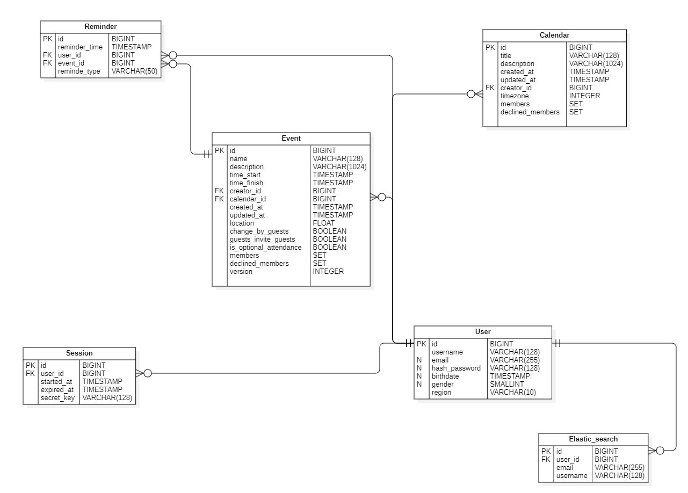
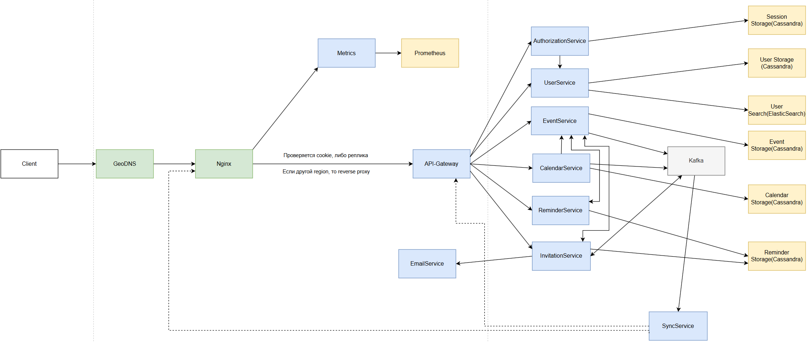

# Google Calendar - описание высоконагруженного сервиса
## Содержание

- [1 Тема и целевая аудитория](#1-Тема-и-целевая-аудитория)
- [2 Расчёт нагрузки](#2-Расчет-нагрузки)
- [3 Глобальная балансировка нагрузки](#3-Глобальная-балансировка-нагрузки)
- [4 Локальная балансировка нагрузки](#4-Локальная-балансировка-нагрузки)
- [5 Логическая схема БД](#5-Логическая-схема-БД)
- [6 Физическая схема БД](#6-Физическая-схема-БД)
- [7 Алгоритмы](#7-Алгоритмы)
- [8 Технологии](#8-Технологии)
- [9 Обеспечение надёжности](#9-Обеспечение-надежности)
- [10 Схема проекта](#10-Схема-проекта)
- [11 Список серверов](#11-Список-серверов)

# 1. Тема и целевая аудитория
[Google Calendar](https://calendar.google.com) - это бесплатный сервис для организации расписания, координации встреч с другими людьми, а также фиксирования и напоминания о важных задачах и событиях.
### MVP функционал
1. Авторизация при помощи аккаунта Google
2. Отображение календаря
3. Добавление новых задач на календарь
4. Изменить информацию о задаче
5. Уведомления о ближайших событиях
6. Добавить гостей к мероприятию(задаче)
7. Просмотр календаря другими пользователями

### Целевая аудитория
* MAU (monthly active users) - ~ 500 млн чел [8]
* Т.к. нет информации по DAU - возьмем средний Sticky Factor(отношение DAU к MAU)[2] = 25% -> DAY ~ 125 млн чел
* Средняя длина сессии - 7:39 [3]
* Количество посещений в день - 40 млн [12]
* Создается более 1,5 млрд событий в календарях каждый день [7]
* Около 1.1 млрд сайтов используют этот календарь [1]
* 398 тыс. компаний используют Google Calendar [1]
* Для отрослевого рынка - 23,91% [1]
#### Аудитория по странам:

#### Демография посещаемости сайта:

# 2. Расчет нагрузки
### Продуктовые метрики
* MAU (monthly active users) - ~ 500 млн чел [[8]](https://web.archive.org/web/20250125115152/https://www.patronum.io/key-google-workspace-statistics-for-2023)
* Т.к. нет информации по DAU - возьмем средний Sticky Factor(отношение DAU к MAU) = 25% -> DAU ~ 125 млн чел
#### Размер хранилища пользователя
Для рассчета размера хранилища необходимо найти вес одного события(задачи) и вес одного календаря\
Событие:\
Для удобства напишу весь данных в табличке. Возьмем среднюю заполненность события, и при учете кодировки UTF-8(от 1 до 4 байт, возьму 3 байта как среднее) получим:
Параметр | Вес
------- | -------
Название события | 128 символов -> 3*128=384 Байт
Описание события | 1024 символа -> 3*1024=3072 Байт
Дата начала события | 8 Байт
Дата конца события | 8 Байт
Дата создания события | 8 Байт
Дата обновления события | 8 Байт
Место проведения события | 8 Байт
Время уведомления | 8 байт
Email приглашенного гостя | 255 Байт (85 символов) (Возьмем количество гостей = 2) -> 2*255=510 Байт
Создатель события(ссылка) | 8 Байт
Разрешения для гостей | 2 Байт
Календаль события | 8 Байт
Итого | 384 + 3072 + 8 + 8 + 8 + 8 + 8 + 8 + 510 + 8 + 2 + 8 = 4032 Байт

Итак, в день создается около 1,5 млрд. событий [[7]](https://web.archive.org/web/20240811062050/https://marketsplash.com/google-workspace-statistics/). То есть каждый пользователь создает 1.5 млрд/125 млн = 12 событий в день. В среднем работник проводит около 5 встреч в день [[9]](https://reclaim.ai/blog/productivity-report-one-on-one-meetings). Однако это немного больше кол-во событий для обычного пользователя, поэтому возьмем среднее число - 3 события в день.

Сами события хранятся вечно, удаленные события хранятся 30 дней, приложение синхронизирует события последнего года [[5]](https://www.calendar.com/blog/how-do-you-look-up-past-appointments-in-your-calendar/) -> Хранилище событий на 1 пользователя: 365 * 3 * 4032 = 4,21 Мб

Лимит на созданиее событий = 10000, лимит на создание календарей = 25 [[4]](https://classroom.synonym.com/google-calendar-limits-17378.html)

Календарь:
Параметр | Вес
------ | ------
Название календаря | 128 символов -> 3*128=384 Байт
Описание календаря | 1024 символов -> 3*1024=3072 Байт
Дата создания календаря | 8 Байт
Дата обновления календаря | 8 Байт
Создатель календаря(ссылка) | 8 Байт
Часовой пояс календаря | 8 Байт
Итого | 384 + 3072 + 8 + 8 + 8 + 8 = 3488 Байт

Возьмем лимит на создание календарей(25 штук) и посчитаем размер хранилиша для календарей: 25 * 3488 = 85,15 Кб

Итак, средний размер хранилища пользователя равен(возьмем данные пользователя за 1Кб): 4,21 Мб + 85,15 Кб + 1 Кб = 4,29 Мб

Итог по продуктовым метрикам:
Параметр | Значение
------ | ------
Месячная аудитория | 500 млн. человек
Дневная аудитория | 125 млн. человек
Средний размер хранилища пользователя | 4,29 Мб
Добавление событий | 3 запроса/день
Получение напоминаний о событиях | 2 запроса/день

### Технические метрики
#### Размер хранения в разбивке по типам данных
Возьмем общее число пользователей Google Workspace - 3 млрд чел[[7]](https://web.archive.org/web/20240811062050/https://marketsplash.com/google-workspace-statistics/) -> можем посчитать размер хранения данных

Для событий: 4,29 Мб * 3 млрд. = 11,98 Пб

Для календарей: 85,15 Кб * 3 млрд. = 237,9 Тб

#### Сетевой трафик:
Посчитаем сетевой трафик при просмотре каледаря, создании события, приглашении гостя (возьмем по 2 приглашенныйх гостя), ответ гостя на приглашение, получение напоминания:
* Просмотр календаря: 5 запросов в день -> 5 * 3488 Байт = 17,03 Кб
* Создание события: 3 запроса в день -> 3 * 4032 Байт = 11,81 Кб
* Изменить информацию о задаче(событии): 1 запрос в день -> 1 * 4032 Байт = 3,93 Кб
* Приглашение гостя: 4 запроса в день (приглашение = 1Кб) -> 4 * 2 * 1 Кб = 8 Кб
* Ответ гостя: 3 запроса в день -> 3 * 1 Кб = 3 Кб
* Получение напоминания: 2 запроса в день -> 2 * 1 Кб = 2 Кб

Потребление трафика:
Возьмем, что пиковое значение превышает среднее в 2 раза
Тип трафика | Данные | Пиковое в Гбит/c | Суммарный суточной Гб/cутки
------ | ------ | ----- | -----
Просмотр календаря | 125 млн * 17,03 Кб = 16 241,1 Гбит | 0,37 | 84,5
Создание события | 125 млн * 11,81 Кб = 11 262,9 Гбит | 0,26 | 58,66
Изменить информацию о задаче(событии) | 125 млн * 3,93 Кб = 3 747,9 Гбит | 0,08 | 19,52
Приглашение гостя | 125 млн * 8 Кб = 7 629,4 | 0,17 | 39,7
Ответ гостя | 125 млн * 3 Кб = 2 861,1 | 0,06 | 14,9
Получение напоминания | 125 млн * 2 Кб = 1 907,3 | 0,04 | 9,93
Итого | 43 648,7 Гбит | 0,98 | 227,21

#### RPS
Возьмем, что пиковое значение превышает среднее в 2 раза
Тип трафика | RPS(средний) | Пиковый RPS  | 
------ | ------ | -----
Просмотр календаря | 125 млн * 5 / (24 * 60 * 60) = 7 234 | 14 468
Создание события | 125 млн * 3 / (24 * 60 * 60) = 4 341 | 8 682
Изменить информацию о задаче(событии) | 125 млн * 1 / (24 * 60 * 60) = 1 447 | 2 894
Приглашение гостя | 125 млн * 4 / (24 * 60 * 60) = 5 788 | 11 576
Ответ гостя | 125 млн * 3 / (24 * 60 * 60) = 4 341 | 8 682
Получение напоминания | 125 млн * 2 / (24 * 60 * 60) = 2 894 | 5 788
Итого | 26 045 | 52 090

# 3. Глобальная балансировка нагрузки
Возьмем распределение пользователей по странам[[hypestat]](https://hypestat.com/info/calendar.google.com):

Видим, что больше всего пользователей в США. Дальше идут Индия, Япония, Россия, Европа и Бразилия.

Таким образом, целесообразно разместить ДЦ(учитывая самые крупные города США[[10]](https://travelask.ru/articles/goroda-ssha-po-chislennosti-naseleniya) и другие крупные города[[11]](https://ru.wikipedia.org/wiki/Список_городов_с_населением_более_миллиона_человек):
* США, Нью-Йорк
* США, Лос-Анджелес
* США, Чикаго
* Индия, Мумбаи
* Бразилия, Сан-Паулу
* Япония, Токио
* Россия, Москва
* Англия, Лондон

Получаем такую карту:


### Распределение запросов по ДЦ

Тип запроса                   | 	RPS (Нью-Йорк) | 	RPS (Лос-Анджелес) | 	RPS (Чикаго) | 	RPS (Мумбаи)	  | RPS (Сан-Паулу) | RPS (Токио)  | 	RPS (Москва) | 	RPS (Лондон) |
-----------------------------|-----------------|---------------------|---------------|-----------------|-----------------|--------------|---------------|---------------|
Просмотр календаря              | 	2 893,6        | 	2 893,6            | 	2 893,6      | 	1 446,8        | 	1 157,44       | 	1 157,44    | 	868,08       | 	1 157,44     |
Создание события                | 	1 736,4        | 	1 736,4            | 	1 736,4	     | 868,2           | 	694,56	        | 	694,56	     | 520.92        | 	694,56       |
Изменить информацию о событии(задаче)           | 	578,80         | 	578,80             | 	578,80 	     | 289,40          | 	231,52	        | 	231,52	     | 173,64        | 	231,52       |
Приглашение гостя            | 	2 315,20       | 	2 315,20           | 	2 315,20     | 1 157,60        | 	926,08	        | 	926,08	     | 694,56        | 	926,08       |
Ответ гостя                | 	1 736,40       | 	1 736,40           | 	1 736,40	    | 868,20          | 	694,56         | 	694,56	     | 520,92        | 	694,56       |
Получение напоминания        | 	1 157,60       | 	1 157,60           | 	1 157,60     | 	578,80         | 	463,04         | 	463,04      | 	347,28       | 	463,04       |
Итого                        | 	10 418,00      | 	10 418,00          | 	10 418,00    | 	5 209,00       | 	4 167,20       | 	4 167,20    | 	3 125,40     | 	4 167,20     |

### Схема балансировки
Из этого можно сделать вывод, что наиболее эффективным будет применение следующих технологий: **BGP Anycast** и **Geo-based DNS**

Использование BGP Anycast оправдано тем, что эта технология позволяет направлять пользователей в ближайший дата-центр в пределах региона с точки зрения маршрутизации BGP. 
Это обеспечивает распределение нагрузки за счет настройки anycast-сетей, что позволяет гибко перенаправлять пользователей в разные дата-центры в зависимости от их местоположения.
Применение Geo-based DNS целесообразно для разделения пользователей по регионам с использованием GeoIP-базы. Это позволяет персонализировать контент, например, показывать региональную 
рекламу или адаптировать контент под конкретный регион. Задержка для такого сервиса не очень важна, так что Latency-Based DNS использовать не будем.

Таким образом, сочетание этих технологий обеспечивает оптимальную маршрутизацию и персонализацию контента для пользователей в зависимости от их географического положения.

## 4. Локальная балансировка нагрузки
Для балансировки нагрузки используется балансировщик уровня L7, обеспечивающий равномерное распределение запросов и решение проблемы с медленными клиентами. Для повышения отказоустойчивости и производительности системы добавлен дополнительный уровень балансировки перед L7.

### Архитектура балансировки нагрузки
В качестве основного балансировщика уровня L7 используется NGINX. Для автоматического обнаружения сервисов реализована обертка вокруг NGINX, которая интегрируется 
с системой оркестрации (например, Kubernetes) и динамически обновляет конфигурацию NGINX при изменении списка доступных сервисов.

### Реализация балансировки
Стратегия балансировки: На уровне L7 применяется стратегия round robin для равномерного распределения запросов между сервисами.
Для ускорения обработки зашифрованных соединений задействован Session Cache.

### Оркестрация сервисов
Управление сервисами осуществляется с помощью Kubernetes, что обеспечивает:

- Автоматическое масштабирование (auto-scaling) для эффективного использования ресурсов.

- Распределение и динамическое перераспределение экземпляров между узлами.

Для повышения надежности системы используется протокол VRRP (Virtual Router Redundancy Protocol). В случае выхода из строя одного из балансировщиков трафик автоматически перенаправляется на резервный сервер, работающий на том же IP-адресе. Это обеспечивает бесперебойную работу системы при распределении нагрузки между несколькими серверами NGINX.

# 5. Логическая схема БД


| User                  | Calendar             | Event                       | Session           | Guests_calendars  | User_to_event                 | Reminder            |
|-----------------------|----------------------|-----------------------------|-------------------|-------------------|-------------------------------|---------------------|
| id (8 B)              | id (8 B)             | id (8 B)                    | id (8 B)          | id (8 B)          | id (8 B)                      | id (8 B)            |
| username (128 B)      | title (128 B)        | calendar_id (8 B)           | user_id (8 B)     | user_id (8 B)     | user_id (8 B)                 | user_id (8 B)       |
| email (255 B)         | creator_id (8 B)     | user_id (8 B)               | started_at (8 B)  | calendar_id (8 B) | event_id (8 B)                | event_id (8 b)      |
| hash_password (128 B) | timezone (72 B)      | created_at (8 B)            | expiret_at (8 B)  |                   | confirmation_of_presence(1 B) | reminder_time (8 B) 
| birthdate (8 B)       | description (1024 B) | updated_at (8 B)            | secret_key(128 B) |                   |                               | reminde_type (50 B) 
| gender (4 B)          | created_at (8 B)     | time_start (8 B)            |                   |                   |                               |
| region (10 B)         | updated_at (8 B)     | time_finish (8 B)           |                   |                   |                               |
|                       |                      | name (128 B)                |                   |                   |                               |
|                       |                      | description (1024 B)        |                   |                   |                               |
|                       |                      | location (4 B)              |                   |                   |                               |
|                       |                      | change_by_guests (1 B)      |                   |                   |                               |
|                       |                      | guests_invite_guests (1 B)  |                   |                   |                               |                     |
|                       |                      | is_optional_attendance(1 B) |                   |                   |                               |                     |


Итого:

|                    | User    | Calendar                                       | Event                                                                                                                                     | Session | Guests_calendars                                          | User_to_event                                                                                                         | Reminder                                    |
| ------------------ |---------|------------------------------------------------|-------------------------------------------------------------------------------------------------------------------------------------------|---------|-----------------------------------------------------------|-----------------------------------------------------------------------------------------------------------------------|---------------------------------------------|
| Вес записи         | 531 B   | 1256 B                                         | 1215 B                                                                                                                                    | 160 B   | 24 B                                                      | 25 B                                                                                                                  | 82 B                                        |
| Количество записей | 3 млрд  | 3(среднее кол-во календарей) * 3 млрд = 9 млрд | 30(число дней) * 12 месяцев * 8 лет активного использования юзерами * 3 (среднее число создаваемых событий в день) * 3 млрд = 25,920 трлн | 3 млрд  | 3 млрд * 2 (среднее число добавленных каледарей) = 6 млрд | 30(число дней) * 12 месяцев * 8 лет активного использования юзерами * 3 (среднее число гостей) * 3 млрд = 25,920 трлн | 2(среднее число напоминаний) * 3 млрд = 6 млрд |
| Общий размер       | 1,44 Тб | 10,2 Тб                                        | 27,97  Пб                                                                                                                                 | 447 Гб  | 1,27 Тб                                                   | 589,35 Тб                                                                                                             | 447,Гб                                      |

RPS:

|                 | Read RPS                                                                                                                  | Write RPS                                                                                                  | 
|-----------------|---------------------------------------------------------------------------------------------------------------------------|------------------------------------------------------------------------------------------------------------|
| User            | 5788(Приглашение гостя) + 1447(Изменить информацию о событии) = 7235                                                      | 5788(Приглашение гостя без аккаунта)                                                                       |  
| Calendar        | 7234(Просмотр календаря)                                                                                                  | 4341(Создание события => изменение даты обновления календаря) + 1447(Изменить информацию о событии) = 5788 |   
| Event           | 7234(Просмотр календаря) + 4341(Ответ гостя) =  11575                                                                     | 4341(Создание события) + 1447(Изменить информацию о событии) = 5788                                        | 
| Session         | 7234(Просмотр календаря) + 1447(Изменить информацию о событии) + 4341(Создание события) + 5788(Приглашение гостя) = 18810 | 5788(Приглашение гостя без аккаунта)                                                                       |  
| Guests_calendar | 7234(Просмотр календаря)                                                                                                  | -                                                                                                          | 
| User_to_event   | 7234(Просмотр календаря)                                                                                                  | 5788(Приглашение гостя)                                                                                    | 
| Reminder        | 7234(Просмотр календаря) + Фоновые проверки(раз в 5 - 15 минут)                                                           | 4341(Создание события)                                                                                     | 


Поскольку пользователь просматривает свои события и календари гораздо чаще, чем редактирует их, то запросов на чтение в БД поступает значительно больше, чем запросов на запись во всех таблицах.

### Требования консистентности:

- Уникальность ключей: Все первичные ключи (PK) и внешние ключи (FK) в таблицах должны быть уникальными. Например, id в таблице User, Event, Calendar и других должен быть уникальным.
- Синхронизация при изменении событий и календарей: При создании, обновлении или удалении событий (Event) или календарей (Calendar), необходимо синхронизировать данные во всех связанных таблицах (User_to_event, Guests_calendars).
- Обновление временных меток: При обновлении данных в любой таблице, всегда устанавливать новое значение updated_at.
- Согласованность данных: При создании новой записи в таблице, где есть created_at, должен срабатывать триггер для автоматического заполнения этого поля.
- Проверка целостности данных: Все внешние ключи ссылаются на существующие записи в связанных таблицах.

### Особенности распределения нагрузки по ключам

Для схемы базы данных можно предложить следующие подходы к распределению нагрузки по ключам:

- Горизонтальное шардирование по пользователям (user_id):
  - Таблицы, такие как User_to_event, Guests_calendar, и Session, которые сильно зависят от пользователя, шардируем по user_id. Это позволит распределить нагрузку на чтение и запись по нескольким узлам, так как запросы, связанные с одним пользователем, будут направляться на конкретный шард.

- Партиционирование по дате:
  - Для таблиц, содержащих временные данные, таких как Event (поля time_start, time_final) и Reminder (поле reminder_time), используем партиционирование по времени. Можно создать партиции по месяцам или неделям. Это упростит управление данными и улучшит производительность запросов, связанных с временными диапазонами.

- Репликация:
  - Для повышения отказоустойчивости и скорости чтения, особенно для таблиц, которые часто используются для чтения, таких как Calendar и Event, используем репликацию. Основной узел (Primary) будет отвечать за запись, а чтение масштабируем за счет Replica-нод. Это особенно полезно для операций, связанных с просмотром календарей и событий.

# 6. Физическая схема БД



## Выбор СУБД

Для таблиц User, Reminder, Session, Calendar и Event целесообразно использовать Cassandra, так как эта СУБД хорошо справляется с большими нагрузками на чтение и запись, и также имеет отличную горизонтальную масштабируемость.

Таблица Elastic_Search предназначена для полнотекстового поиска пользователей при приглашении в события, поэтому для нее используется Elasticsearch.


| User                 | Calendar             | Event                 | Session        | Reminder       | Elastic_Search | 
| -------------------- | -------------------- | --------------------- |----------------| -------------- | -------------- |
| Cassandra            | Cassandra            | Cassandra             | Cassandra      | Cassandra      | Elasticsearch  |


## Индексы

Внутри Cassandra данные хранятся подобным образом: ``Partition Key → [Clustering Key] → Колонки → Значения``
- Partition — как большой блок для строк с одним ключом 
- Внутри — множество строк, отсортированных полям внутри clustering columns
- Каждая строка — набор колонок и значений

Primary Key состоит из:
- Partition Key — определяет, на каком узле будет храниться строка (то есть шардирование).
- Clustering Columns — определяют сортировку внутри партиции (и делают строки уникальными в рамках партиции).

``PRIMARY KEY ((partition_key), clustering_column1, clustering_column2, ...)``

Secondary Index
- Позволяет искать по полям, не входящим в primary key.
- Не масштабируется хорошо при большом количестве уникальных значений.
- Лучше использовать только для низко-кардинальных атрибутов.

SASI (SSTable-Attached Secondary Index)
- Улучшенная версия secondary index.
- Позволяет делать поиск по диапазонам, префиксам, точным совпадениям.
- Лучше работает, чем обычные secondary index, но всё ещё хуже по производительности, чем поиск по primary key.
- SPARSE mode:
  - Индексирует только те строки, где значение заполнено (не null).
  - Оптимизирован для поиска по диапазону (BETWEEN) и для уникальных или почти уникальных значений.
  - Использует меньше памяти, быстрее строится, быстрее ищет при range queries.

Выбранные индексы:
- Таблица Calendar:
  - PRIMARY KEY ((user_id), id), user_id — partition key, шардируем по пользователям, id — clustering, чтобы календарь был уникальным
  - Специальные индексы:
    - title (вторичный индекс) - для точного поиска по полному названию календаря

- Таблица Event:
  - PRIMARY KEY ((user_id), time_start, id): Partition key: (user_id) — логично и шардируется по пользователю, Clustering: time_start для сортировки по времени, id — уникальность
  - Специальные индексы:
    - (time_start, time_finish) (SASI, SPARSE mode) - составной индекс для временного диапазона (сам запрос описан в 7 главе)
    - name (SASI, PREFIX mode) - для быстрого поиска событий по началу названия
    - creator_id (вторичный индекс) - для поиска по создателю (использовать ограниченно)

- Таблица Reminder:
  - PRIMARY KEY ((user_id), remind_time, id): user_id — partition key (шардирование), remind_time — clustering по времени, id — уникальность
  - Особенности:
    - Автоматическое удаление старых напоминаний через TTL (30 дней)
    - Сортировка по возрастанию времени для быстрого доступа к ближайшим
    
- Таблица Elastic_Search:
  - Индекс на email (B-tree) и username (B-tree) для быстрого поиска пользователей.

## Денормализация
Чтобы избежать использования таблиц User_to_calendar и User_to_event, которые требуют неэффективных JOIN-запросов, добавим в таблицы Event и Calendar поля-массивы members и declined_members. Эти поля будут содержать идентификаторы всех участников и тех, кто отказался от участия в событии или календаре соответственно.

Для эффективного поиска пользователей для приглашения в события была добавлена таблица Elastic_Search, которая обеспечивает быстрый поиск по пользователям с использованием СУБД Elasticsearch.

RPS после денормализации:

|                   | Read RPS                                                                                                                  | Write RPS                                                                                                  | 
|-------------------|---------------------------------------------------------------------------------------------------------------------------|------------------------------------------------------------------------------------------------------------|
| User              | 5788(Приглашение гостя) + 1447(Изменить информацию о событии) = 7235                                                      | 5788(Приглашение гостя без аккаунта)                                                                       |  
| Calendar          | 7234(Просмотр календаря)                                                                                                  | 4341(Создание события => изменение даты обновления календаря) + 1447(Изменить информацию о событии) = 5788 |   
| Event             | 7234(Просмотр календаря) + 4341(Ответ гостя) =  11575                                                                     | 4341(Создание события) + 1447(Изменить информацию о событии) = 5788                                        | 
| Session           | 7234(Просмотр календаря) + 1447(Изменить информацию о событии) + 4341(Создание события) + 5788(Приглашение гостя) = 18810 | 5788(Приглашение гостя без аккаунта)                                                                       |
| Invintation_error | 5788(Приглашение гостя) * 10 % = 578                                                                                      | 5788(Приглашение гостя) * 10 % = 578                                                                       |
| Reminder          | 7234(Просмотр календаря) + Фоновые проверки(раз в 5 - 15 минут)                                                           | 4341(Создание события)                                                                                     | 

## Шардирование

Шардирование в Cassandra основано на partition key. Он определяет, на каком узле хранится конкретная строка:
- У каждой строки есть partition key (часть primary key).
- Этот ключ хэшируется через consistent hashing (обычно Murmur3). 
- Хэш указывает, на какой узел (или узлы) попадёт строка.

Cassandra автоматически делает шардирование при помощи token range. У каждого узла есть свой диапазон токенов.

| User                 | Calendar | Event    | Reminder      | Session | Elastic_Search | 
| -------------------- |----------|----------|---------------|---------|----------------|
| id                   | user_id  | user_id  | user_id       | user_id | username       |

- Elastic_Search: Шардирование по полю username рекомендуется для эффективного поиска, с учетом ограничения размера шарда в 50 GB.

## Репликация
Настроим кластеры с NetworkTopologyStrategy
```a
/ тяжёлые данные, которые должны жить только в родном DC пользователя */
CREATE KEYSPACE calendar_app
WITH REPLICATION = {
  'class' : 'NetworkTopologyStrategy',
  /*-- одинаковый RF=3 в каждом из восьми регионов--*/
  'NY'  : 3, 'LA'  : 3, 'CHI' : 3,
  'MUM' : 3, 'SP'  : 3, 'TOK' : 3,
  'MSK' : 3, 'LDN' : 3
};

/ лёгкий глобальный справочник пользователей — реплицируем полностью */
CREATE KEYSPACE users_global
WITH REPLICATION = {
  'class' : 'NetworkTopologyStrategy',
  / те же DC, тот же RF = 3 — но записи вставляются во все регионы */
  'NY'  : 1, 'LA'  : 1, 'CHI' : 1,
  'MUM' : 1, 'SP'  : 1, 'TOK' : 1,
  'MSK' : 1, 'LDN' : 1
};
```
Для таблицы Users:
- Полная репликация во все дата-центры (RF=1 в каждом).
- Чтение: Всегда используем LOCAL_QUORUM для минимальной задержки.
- Запись: Применяем QUORUM для критичных полей (например, region).

Для остальных таблиц:
- Данные хранятся только в "домашнем" ДЦ пользователя (определяется по полю region).
- Репликация только внутри локального ДЦ (RF=3).

Для geo парционирования добавим поле region у пользователя, которое будет заполняться в момент регистрации.
Проксирование будет на уровне API Gateway.
``User -> Local API Gateway -> Определение нужного DC -> Проксирование в удалённый DC``

Когда пользователь залогинился в Токио, а данные у него в Нью-Йорке,
Nginx в Токио reverse-proxy'т запрос в Нью-Йорк:
→ То есть локальный Nginx сам сделает запрос на API Gateway Нью-Йорка от имени пользователя.

## Клиентские библиотеки

Для языка Go, на котором будет разработан backend, можно использовать следующие библиотеки:
- Cassandra: gocql
- Elasticsearch: go-elasticsearch

## Резервное копирование

Планируется проводить полное резервное копирование каждые две недели и дифференциальное резервное копирование каждые два дня.

# 7. Алгоритмы


# 8 Технологии

| Технология    | Область применения                       | Обоснование                                                                                                       |
|---------------|------------------------------------------| ----------------------------------------------------------------------------------------------------------------- |
| Typescript    | Фронтенд                                 | Статически типизируемый язык программирования, который преобразуется в JavaScript, но при этом за счёт статической типизации позволяет избежать ошибок на этапе написания кода. |
| React         | Фронтенд                                 | Библиотека для построения пользовательских интерфейсов. Подходит для SPA, поддерживает эффективный рендеринг благодаря Virtual DOM, а также имеет огромную поддержку и хорошую масштабируемость. |
| Golang        | Бэкенд                                   | Язык программирования для серверной части приложения. Имеет очень эффективную модель многопоточности, которая рациональна для использования в высоконагруженных сервисах. |
| Nginx         | Балансировщик нагрузки уровня L7         | Высокопроизводительный веб-сервер и обратный прокси-сервер, часто используется как балансировщик нагрузки. Обладает высокой скоростью, гибкостью конфигурации и хорошей поддержкой. |
| Docker        | Среда выполнения контейнеров             | Инструмент для контейнеризации приложений. Основными преимуществами такого подхода являются изолированность приложений и их независимость от среды и окружения. |
| Kubernetes    | Оркестрация и развертывание контейнеров  | Система оркестрации контейнеризированных приложений. Позволяет управлять кластером контейнеров, а также помагает в балансировке за счёт автоматического распределения нагрузки, самоисцеления сервисов и масштабирования. |
| Prometheus    | Сбор метрик                              | Быстрая и мощная система для сбора аналитики. Отслеживает показатели производительности и состояния в режиме реального времени, а также хранит эти метрики. |
| Grafana       | Визуализация метрик, мониторинг          | Визуализирует метрики из Prometheus или других источников в виде графиков, что служит для эффективного анализа собранных данных и быстрой реакции на непредусмотренное поведение системы. |
| Cassandra     | Основная база данных                     | NoSQL СУБД, разработанная для обработки больших объемов данных с высокой доступностью, масштабируемостью и без единой точки отказа. Подходит для хранения и обработки большого количества данных с существенной нагрузкой на чтение и запись (например, таблица событий). |
| Elasticsearch | Система хранения и поиска данных         | Открытая распределённая система управления данными и поиска по ним. В проекте используется для эффективного поиска пользователей. |
| Apache Kafka  | Брокер сообщений                         | Система для обработки потоков данных в режиме реального времени. В нашем приложении используется для доставки приглашений, так как обеспечивает асинхронное взаимодействие между сервисами и позволяет обрабатывать огромные объёмы данных. |


# 9 Обеспечение надежности

| Компонент системы | Способ резервирования         | Иные механизмы                                         | Пояснение                                                                                                    |
|-------------------|-------------------------------|--------------------------------------------------------|--------------------------------------------------------------------------------------------------------------|
| Nginx (Ingress)   | Kubernetes ReplicaSet + HPA   | Readiness/Liveness Probes, Pod Anti-Affinity           | Автоматическое масштабирование и восстановление Pods через Kubernetes.                                       |
| Cassandra         | Репликация (master-slave)     | replication_factor=3, автоматическое восстановление    | Обеспечивает отказоустойчивость: при выходе из строя одного узла данные доступны с других реплик             |
| Kafka             | Репликация брокеров           | Автоматическая балансировка, распределённые партиции   | При сбое одного брокера его партиции обрабатываются оставшимися репликами                                    |
| Elasticsearch     | Репликация шардов             | Хранение реплик индексов                               | Реплики позволяют сохранить данные при недоступности основного шарда                                         |
| API Gateway       | Active-Active                 | Масштабирование, мониторинг через Prometheus/Grafana   | Несколько инстансов одновременно обрабатывают запросы; масштабируются по нагрузке                            |
| Data Center       | Резервные ЦОД                 | Tier-4 архитектура, охлаждение, ИБП, резервное питание | Использование нескольких ЦОД с высокой надёжностью позволяет продолжить работу даже при отказе одного из них |


### Дополнительные меры надёжности:
- Резервное копирование БД — позволяет минимизировать потери данных в случае серьёзных сбоев.

- Корректное завершение работы (Graceful Shutdown) — позволяет безопасно завершить работу сервисов, не теряя данные.

- Плавное снижение функциональности (Graceful Degradation) — при сбоях отдельных компонентов система продолжает работу в урезанном режиме.

- Асинхронная архитектура — использование очередей сообщений (например, Kafka) разгружает сервисы и повышает их устойчивость.

- CQRS — разделение запросов на чтение и запись помогает балансировать нагрузку на базу данных.

- Логирование — позволяет оперативно выявлять и анализировать ошибки.

- Мониторинг (Prometheus, Grafana) — обеспечивает контроль за состоянием и производительностью компонентов системы.

# 10. Схема проекта



Разбиение на микросервисы:
- Можно менять ReminderService (например, перейти с email на пуши) без единой правки в CalendarService или EventService.
- Масштабирование: Можно масштабировать отдельно EmailService при пиковой нагрузке (например, массовая рассылка уведомлений), а остальное оставить как есть.
- Отказоустойчивость: Если ReminderService сломается — календари и события останутся рабочими.
- Развитие командой: Могут работать разные команды/разработчики над EventService и CalendarService параллельно.
- Проще тестировать: Каждый сервис тестируется отдельно, легко писать модульные и интеграционные тесты.

Пользовательский запрос начинает свой путь с клиента и поступает на GeoDNS-сервер, который, основываясь на геолокации пользователя, 
направляет его на ближайший экземпляр Nginx. Здесь происходит первичная маршрутизация: после логина мы сохраняем регион пользователя напрямую
в cookie. Если пользователь логиниться впервые или он удалил cookie, то в каждом дата-центре хранится реплика всех пользователей (таблицы Users),
если регион пользователя совпадает с регионом дата-центра, запрос напрямую передаётся в API Gateway. В противном случае Nginx перенаправляет
запрос в upstream ReverseProxy, который занимается межрегиональной маршрутизацией и отправляет запрос в правильный дата-центр, 
соответствующий региону пользователя.

На уровне API Gateway запрос классифицируется и передаётся в один из бизнес-микросервисов: AuthorizationService, UserService, 
EventService, CalendarService, ReminderService или InvitationService. API Gateway служит единым входом для всех взаимодействий клиента с 
системой, обеспечивая маршрутизацию, аутентификацию, авторизацию и контроль версий API.

AuthorizationService отвечает за регистрацию, аутентификацию и валидацию сессий пользователей. Он взаимодействует с Session Storage 
(на Cassandra) для управления жизненным циклом сессий. UserService обрабатывает профили пользователей и осуществляет доступ к User 
Storage (Cassandra) и User Search (ElasticSearch), предоставляя быстрый поиск по профилям.

EventService занимается обработкой событий: их созданием, обновлением и удалением. Он напрямую связан с Event Storage в Cassandra. 
CalendarService управляет календарями пользователей и обращается к Calendar Storage для хранения данных. CalendarService и EventService 
тесно интегрированы между собой: изменение календаря может инициировать синхронизацию событий, связанных с этим календарём.

Для обеспечения асинхронного взаимодействия между микросервисами используется Kafka. Когда в EventService или CalendarService 
происходят изменения, публикуются события в Kafka (например, о создании, обновлении или удалении сущностей). Это позволяет 
остальным сервисам, таким как ReminderService и InvitationService, реагировать на изменения без жёсткой связки через синхронные вызовы.

InvitationService принимает участие в отправке приглашений на события. При создании приглашения оно записывается в Kafka, что 
гарантирует надёжность доставки: даже если EmailService временно недоступен, приглашение не будет потеряно. EmailService, 
прослушивая Kafka, получает уведомления о новых приглашениях и отправляет соответствующие письма пользователям.

Для обеспечения согласованности данных между пользователями, участвующими в общих календарях или событиях, используется 
отдельный микросервис SyncService. Он подписывается на события Kafka о любых изменениях календарей и событий и занимается 
синхронизацией данных у всех участников, даже если их данные физически находятся в разных шардах или дата-центрах.

Мониторинг всей системы осуществляется с помощью Metrics-сервиса, который собирает информацию о работе всех компонентов и 
передаёт её в Prometheus для последующего анализа и визуализации.

# 11. Список серверов

В качестве расчёта возьмём данные из главы 2.

## Микросервисы

| Сервис            | Пиковый RPS (из §2) | Характер нагрузки   | **CPU**<br/>`= RPS / RPS_на_1_ядро` | **RAM**<br/>`= CPU × MB_на_ядро` | Выходной трафик |
|-------------------| ------------------- |---------------------|-------------------------------------| -------------------------------- | --------------- |
| **Authorization** | 2 600               | лёгкая (Go Gin)     | 2 600 / 200 ≈ **13 CPU**            | 1 × 50 ≈ **50 MB**               | ≈ 50 Mbit/s     |
| **User**          | 1 100               | средняя (Go CRUD)   | 1 100 / 100 ≈ **11 CPU**            | 2 × 100 ≈ **200 MB**             | 20 Mbit/s       |
| **Calendar**      | 14 468              | лёгкая              | 14 468 / 200 ≈ **72 CPU**           | 3 × 50 ≈ **150 MB**              | 300 Mbit/s      |
| **Event**         | 20 258              | тяжёлая (Go-stream) | 20 258 / 50 ≈ **405 CPU**           | 68 × 200 ≈ **13,6 GB**           | 500 Mbit/s      |
| **Invitation**    | 11 576              | средняя             | 11 576 / 100 ≈ **116 CPU**          | 12 × 100 ≈ **1,2 GB**            | 200 Mbit/s      |
| **Reminder**      | 5 788               | средняя             | 5 788 / 100 ≈ **58 CPU**            | 6 × 100 ≈ **600 MB**             | 100 Mbit/s      |
| **Sync**          | 2 000               | средняя             | 2 000 / 100 ≈ **20 CPU**            | 2 × 100 ≈ **200 MB**             | 50 Mbit/s       |
| **Email / SMTP**  | 2 000               | средняя             | 2 000 / 100 ≈ **20 CPU**            | 1 × 50 ≈ **50 MB**               | 50 Mbit/s       |
| **API Gateway**   | 52 090              | маршрутизация       | 52 090 / 200 ≈ **260 CPU**          | 11 × 50 ≈ **550 MB**             | 1 Gbit/s        |
| **Nginx**         | 52 090              | reverse-proxy       | 52 090 / 500 ≈ **103 CPU**          | 11 × 10 ≈ **110 MB**             | 1 Gbit/s        |

| Стек (runtime)        | RPS / 1 vCPU | RAM / 1 vCPU |
|-----------------------|--------------|--------------|
| Go (Gin, multiplexer) | 200          | 50 MB        |
| Go (обычный CRUD)     | 100          | 100 MB       |
| Go (stream / heavy)   | 50           | 200 MB       |
| Nginx                 | 500          | 10 MB        |


---

## Базы данных

Исходные данные:

| Таблица   | Вес записи | Количество записей | Итоговый размер |
|-----------|------------|--------------------|-----------------|
| User      | 531 B      | 3 млрд             | 1,44 ТБ         |
| Calendar  | 1256 B     | 9 млрд             | 10,2 ТБ         |
| Event     | 1215 B     | 25,92 трлн         | 27,97 ПБ        |
| Session   | 160 B      | 3 млрд             | 447 ГБ          |
| Reminder  | 82 B       | 6 млрд             | 447 ГБ          |

Дополнительные расчёты:
- Репликация (RF=3): 28 ПБ × 3 = 84 ПБ
- Накладные расходы на compaction(слияние SSTable файлов в один) (+40%): 84 ПБ × 1,4 ≈ 117,6 ПБ
- Запас на рост (+50%): 117,6 ПБ × 1,5 ≈ **176 ПБ**

**Итого планируемый размер хранения данных в Cassandra: ~176 ПБ.**

---

### Таблица по базам данных

| Компонент / тип нагрузки  | Примеры технологий           | **RPS / 1 CPU** | **RAM / 1 CPU** |
|---------------------------|------------------------------| --------------- |-----------------|
| **Nginx / Reverse Proxy** | Nginx                        | 5 000           | 10 MB           |
| **Elasticsearch (поиск)** | Elastic (read-heavy)         | 100 RPS         | 1 GB            |
| **Cassandra**             | Cassandra (RF=3, compaction) | 50 RPS          | 200 MB          |


На все дата-центры:

| База данных                                        | Целевая нагрузка     | CPU  | RAM     | Диск      |
|----------------------------------------------------|----------------------|------|---------|-----------|
| Cassandra (Events, Calendars, Reminders, Sessions) | 52 000 RPS           | 1040 | 6000 GB | ~176 PB   |
| ElasticSearch (User Search)                        | 1 100 RPS            | 11   | 96 GB   | 5 TB      |
| Kafka Cluster (Event Bus)                          | 10 000 сообщений/сек | 200  | 64 GB   | 5 TB      |

---

## Пояснения:

### CPU

Допущения:
- Лёгкая бизнес-логика: 1 CPU на 1000 RPS.
- Средняя бизнес-логика: 1 CPU на 100 RPS.
- Тяжёлая бизнес-логика: 1 CPU на 10 RPS.
- Kafka-сервисы: минимум 1 CPU

### RAM

- Лёгкая бизнес-логика: 50 MB на 500 RPS.
- Средняя бизнес-логика: 100 MB на 100 RPS.
- Тяжёлая бизнес-логика: 200 MB на 1 RPS.

Примеры:
- JSON-запросы ~1-2 KB.
- События EventService ~5-10 KB.
- Kafka сообщения ~1 KB.

---

## Выбор модели развертывания

Для оркестрации используется **Kubernetes (k8s)**.

| Сервис        | CPU/конт. | RAM/конт. | Контейнеров |
|---------------|-----------|-----------|-------------| 
| Authorization | 2         | 0.25 GB   | 7           |
| User          | 2         | 0.25 GB   | 6           | 
| Calendar      | 4         | 0.25 GB   | 18          |
| Event         | 4         | 2 GB      | 102         |
| Invitation    | 4         | 0.5 GB    | 29          |
| Reminder      | 2         | 0.25 GB   | 29          |
| Sync          | 2         | 0.25 GB   | 10          |
| Email         | 2         | 0.25 GB   | 10          |
| API Gateway   | 4         | 0.5 GB    | 65          |
| Nginx         | 2         | 0.25 GB   | 52          |
| Итого         | —         | —         | 328         |


Количество контейнеров рассчитано из нормы:
- Лёгкая логика — 500–600 RPS на контейнер.
- Средняя логика — 200–300 RPS на контейнер.
- Тяжёлая логика — 50–100 RPS на контейнер.

---

## Выбор модели хостинга

Выбрана модель использования **собственного железа** (on-premise):

- Cassandra-кластеры для хранения событий, календарей, напоминаний и сессий.
- Kafka-кластеры для асинхронной передачи событий.
- ElasticSearch для быстрого поиска пользователей.

---

## Серверные спецификации

| Сервисный блок         | Конфигурация сервера                                                    | CPU / нода | RAM / нода | NVMe SSD   | HDD  | Узлов на 1 ДЦ | Всего узлов | Цена / ноду  | **Итого € / мес** |
|------------------------|-------------------------------------------------------------------------|------------|------------|------------|------|---------------|-------------|--------------|-------------------|
| **Kubernetes Worker**  | 2U AMD EPYC 7313P, 32c, 128 GB RAM, 2×4 TB NVMe                         | 32         | 128 GB     | 8 TB       | –    | 44            | 352         | €1 400       | €492 800          |
| **Kubernetes Control** | 1U AMD EPYC 7313P, 16c, 64 GB RAM, 2×1 TB SSD                           | 16         | 64 GB      | 2 TB (SSD) | –    | 3             | 24          | €800         | €19 200           |
| **Cassandra**          | 2U AMD EPYC 9654P, 96c, 512 GB RAM, 24×15 TB NVMe (≈250 TB эффективных) | 96         | 512 GB     | 360 TB raw | –    | 88            | 704         | €5 000       | €3 520 000        |
| **Kafka Broker**       | 1U AMD EPYC 7313P, 16c, 64 GB RAM, 2×3.2 TB NVMe                        | 16         | 64 GB      | 6.4 TB     | –    | 3             | 24          | €700         | €16 800           |
| **Elasticsearch Node** | 1U AMD EPYC 7543P, 32c, 128 GB RAM, 2×7.6 TB NVMe                       | 32         | 128 GB     | 15.2 TB    | –    | 5             | 40          | €1 200       | €48 000           |
| **ИТОГО:**             |                                                                         |            |            |            |      | 43 / ДЦ       | 1 144       | —            | €4 096 800        |


**Итого:** 1 144 нод, **€4,096,800/мес**

---
### Список литературы
1. https://earthweb.com/blog/google-calendar-users/
2. https://www.sostav.ru/education/technologies/mail-ru-group-klyuchevye-metriki-dlya-mobilny-175.html
3. https://www.similarweb.com/ru/website/calendar.google.com/#overview
5. https://classroom.synonym.com/google-calendar-limits-17378.html
6. https://www.calendar.com/blog/how-do-you-look-up-past-appointments-in-your-calendar/
7. https://web.archive.org/web/20240811062050/https://marketsplash.com/google-workspace-statistics/
8. https://web.archive.org/web/20250125115152/https://www.patronum.io/key-google-workspace-statistics-for-2023
9. https://reclaim.ai/blog/productivity-report-one-on-one-meetings
10. https://travelask.ru/articles/goroda-ssha-po-chislennosti-naseleniya
11. https://ru.wikipedia.org/wiki/Список_городов_с_населением_более_миллиона_человек
12. https://hypestat.com/info/calendar.google.com
